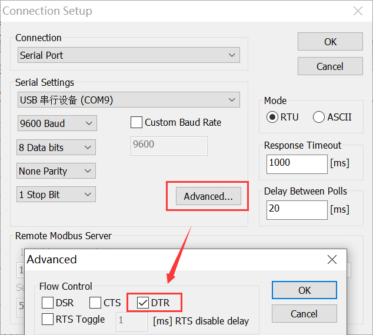
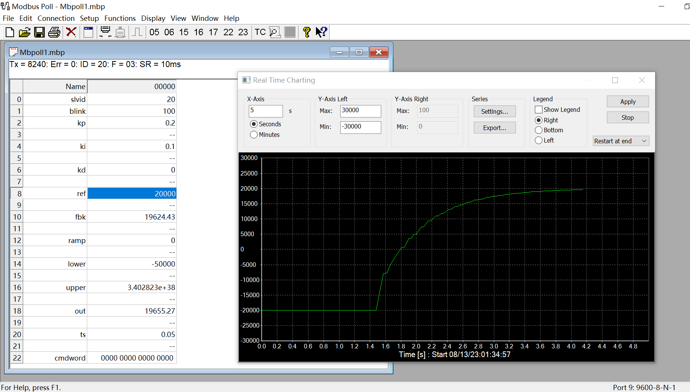
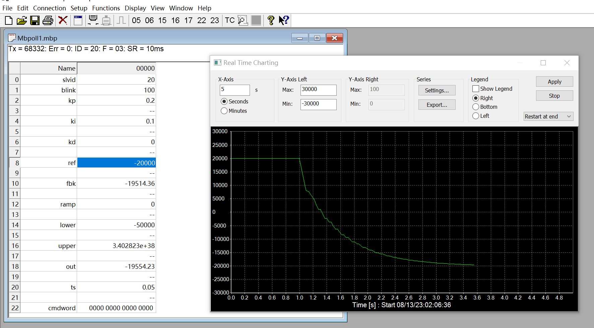
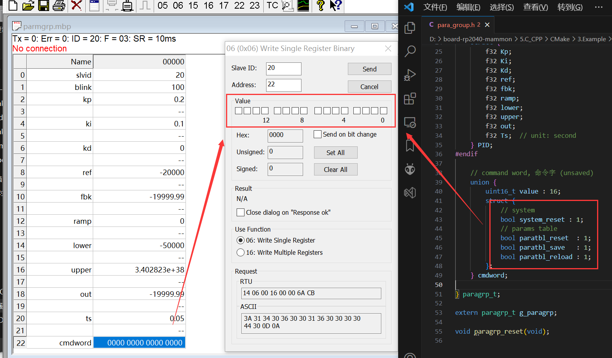

程序会通过 usb 虚拟出两个串口。

一个作为 modbus 的从站通信口，一个作为 printf 等调试输入输出口。

**连接设备**：串口参数任意，但 `DTR` 必须勾选。

**闪灯测试**：LED 电平翻转时间间隔 blink。

**PID 测试**：修改期望值 ref，将输出值 out 绑定到图表，进行实时显示。

- 幅度限制：lower，upper
- 斜率限制：ramp
- 计算间隔：每隔 ts （单位 s） 时间更新1次 PID输出

**控制字**

修改相应的比特位，触发相应命令。

如修改 modbus 的从机地址后，往 bit0,bit1 写1，系统保存参数表到 flash 里，然后芯片复位。

在从 flash 加载数据到参数表，即完成 modbus 的从机地址切换。（注：此时的 mbpoll 需重新连接）

